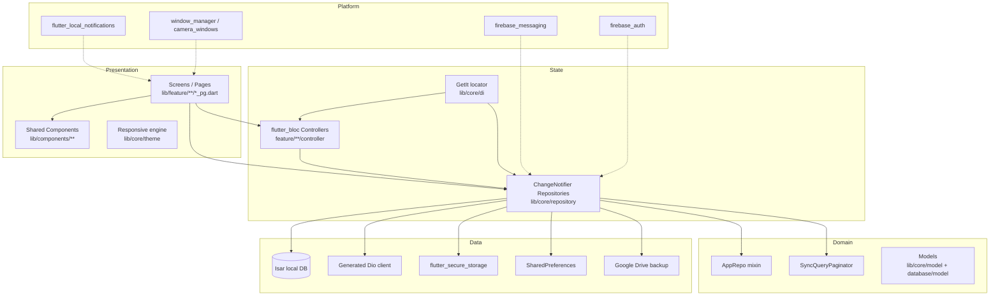
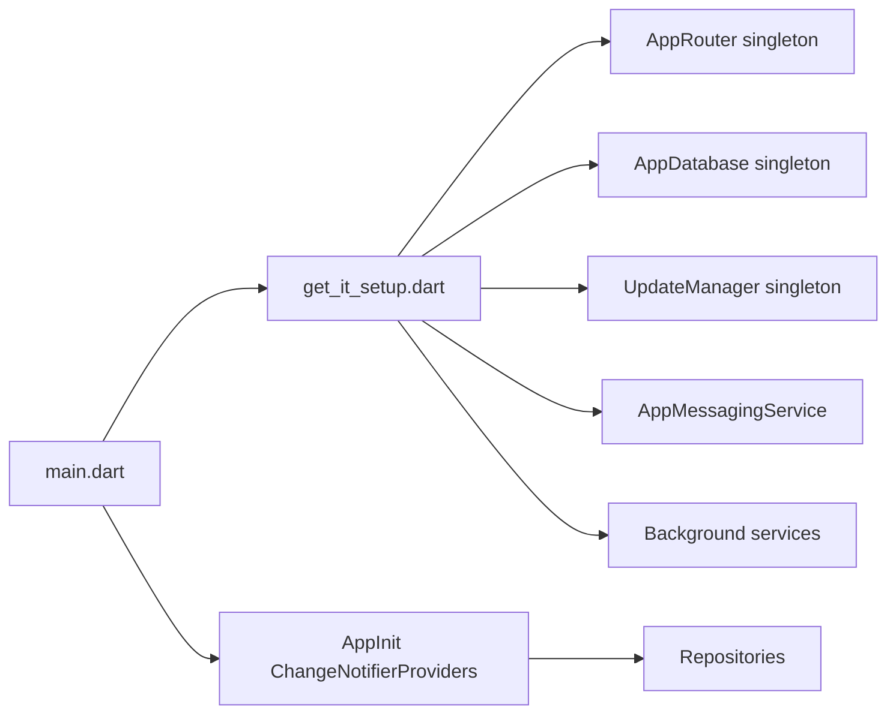
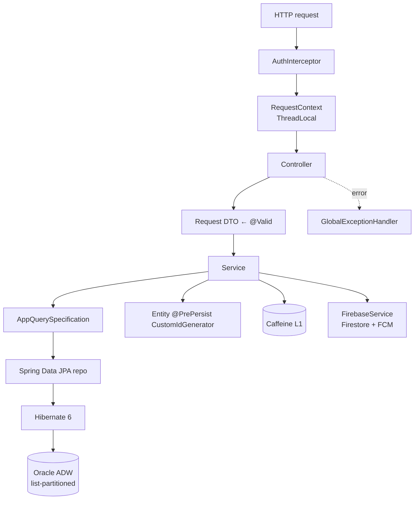
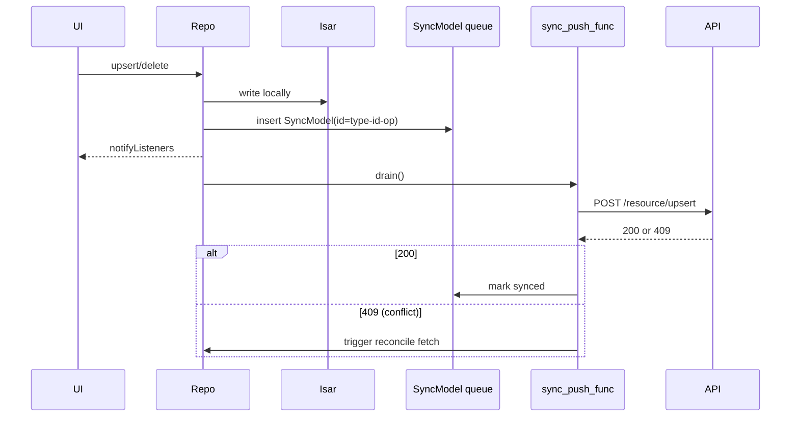
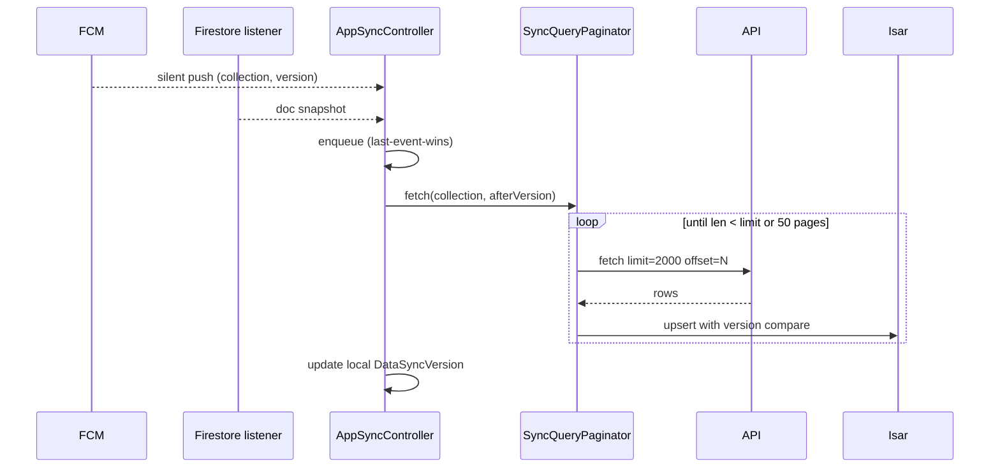
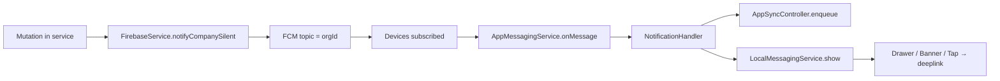

# ARCHITECTURE.md — Vanigam

> Deep engineering documentation. Covers the Flutter clean-architecture, the Spring Boot layered architecture, the bidirectional sync engine, generated-code pipelines, dependency injection, and cross-platform packaging.

---

## 1. Architectural Goals

| Goal                       | How it's met                                                                                                                                                          |
| -------------------------- | --------------------------------------------------------------------------------------------------------------------------------------------------------------------- |
| **Offline-first UX**       | Every screen reads from Isar; network is a _sync_ side-effect, never a _read_ dependency.                                                                             |
| **Multi-tenant isolation** | Oracle list partitioning by `(organisation_id, fy_account_id)` + `AuthInterceptor` rejects header mismatches with `424 ORG_ID_MISMATCH`.                              |
| **Cross-platform parity**  | Single Flutter codebase; responsive engine picks `desktop_home_pg.dart` ↔ `mobile_home_pg.dart`; platform channels limited to camera, secure storage, window manager. |
| **Contract-first APIs**    | Springdoc generates OpenAPI 3 → Dart client is generated by `cli/generate_swagger.dart`.                                                                              |
| **Optimistic concurrency** | `@Version` on every mutable entity; conflicts surface as `409` and route to a UI reconcile dialog.                                                                    |
| **Eventual consistency**   | Silent FCM + `DataSyncVersion` cursor pulls; last-event-wins reconciliation.                                                                                          |
| **Auditability**           | `DELETE_RECORD` server-side, `DeleteRecordModel` client-side, version stamps everywhere.                                                                              |

---

## 2. Flutter — Clean Architecture

### 2.1 Layers



### 2.2 Dependency rules

1. **Presentation depends on State.** Screens never instantiate Dio or Isar directly.
2. **State depends on Domain & Data abstractions** through repositories.
3. **Generated code (Dio, Isar, auto_route, dart_mappable) is treated as Data adapters.** It is not imported into screens.
4. **Cross-cutting (FCM, Auth) is injected at app boot in [`AppInit`](../lib/feature/app_init.dart).**

### 2.3 Repository pattern

Each domain has a `ChangeNotifier` repository in [lib/core/repository/](../lib/core/repository/):

```dart
class InvoiceRepository extends ChangeNotifier with AppRepo {
  final AppDatabase _db;
  final SpringApi _api;
  Future<void> upsert(Invoice inv) async {
    await _db.invoices.put(inv.toModel());          // 1. local first
    await _queueSync(inv);                          // 2. enqueue SyncModel
    notifyListeners();                              // 3. UI update
    unawaited(_flush());                            // 4. fire-and-forget push
  }
}
```

Common helpers come from:

- **`AppRepo` mixin** — transaction batching, error translation, deletion tracking.
- **`SyncQueryPaginator`** — paginated incremental pulls; lives at `lib/core/repository/utils/sync_query_paginator.dart` (note the import gotcha in user memory — `core.export.dart` does **not** re-export it).
- **`DeleteEntityRepo`** — handles `DeleteRecord` propagation.

### 2.4 Dependency injection

Implemented in [lib/core/di/](../lib/core/di/) with `get_it`:



`Provider` is layered on top of `get_it` so repositories can be both **globally locatable** and **scoped via context** for widget rebuilds.

### 2.5 Routing

- Framework: `auto_route` v11.
- Source: `lib/config/router/app_router.dart`, generated: `app_router.gr.dart`.
- 50+ routes including nested transactions, drawer-level home, modal forms.
- Deep-link builder at `lib/config/router/deeplink_builder.dart` handles `https://app.vanigam.{companyURL}/...`.
- `MyRouteObserver` records navigation history for back-stack heuristics.

### 2.6 State management hybrid — why two patterns

- **ChangeNotifier repositories** — global, long-lived, shared across features. Naturally fit _data_ state (lists of invoices, parties).
- **Bloc controllers** — short-lived, scoped to a screen (e.g., `AppHomeController`). Carry _interaction_ state (filters, selected tab, drag/drop) without polluting repositories.

The trade-off keeps the **data plane** simple (one source of truth per domain) and the **interaction plane** testable.

---

## 3. Spring Boot — Layered Architecture



### 3.1 Controller layer

- 9 controllers grouped by domain (`AuthController`, `InvoiceController`, `CollectionController`, `VoucherController`, `OrderController`, `PartyController`, `ProductController`, `EmployeeController`, `DataEntityController`).
- Use `@Valid` request bodies for declarative validation.
- Return either:
  - **Single entity / DTO** (`200`) for create/update.
  - **`SyncQueryResponse`** for fetch endpoints (paginated).
  - **`204 No Content`** for deletes.
  - **`304 Not Modified`** when `NoChangedRequiredException` is thrown.

### 3.2 Service layer

- Services hold **transactional boundaries** (`@Transactional`).
- They consult **Caffeine cache** for hot reads (`@Cacheable("users", key="#uId")`).
- They emit **side-effects** through `FirebaseService.notifyCompanySilent(orgId)` and `Firestore` writes after a successful commit (the `@TransactionalEventListener(AFTER_COMMIT)` pattern is recommended for the broadcast).

### 3.3 Repository layer

- Spring Data JPA interfaces.
- Custom Specifications via [`AppQuerySpecification`](../../vanigam_server/src/main/java/in/subbu/vanigam/repository/function/AppQuerySpecification.java) — composable predicates for sync queries (`afterVersion`, `dateRange`, `statuses`, `ids`, `companyId`).
- ID generation via `@PrePersist` calling `SpringContext.getBean(CustomIdGenerator.class).generateId(prefix)`.

### 3.4 Middleware & cross-cutting

- **`AuthInterceptor`** (HandlerInterceptor) — registered in `WebConfig`. Extracts `Authorization`, `X-Org-Id`, `X-Fy-Account-Id`, `X-Device-Id`, validates the Firebase token, loads `AuthUser`/`Organisation`/`Employee`/`FyAccount`, stuffs them into `RequestContext`.
- **`GlobalExceptionHandler`** (`@RestControllerAdvice`) — maps domain exceptions to HTTP status codes (see table below).
- **`@DbForeignKey`** annotation + `ForeignKeyRunner` — startup-time validation of inter-entity references; catches mis-configured `@ManyToOne` declarations before traffic hits the API.

| Exception                                 | HTTP | Code                  |
| ----------------------------------------- | ---- | --------------------- |
| `BadRequestException`                     | 400  | BAD_REQUEST           |
| `JsonMappingException`                    | 400  | JSON_MAPPING_ERROR    |
| `JsonProcessingException`                 | 400  | JSON_PROCESSING_ERROR |
| `OrgMismatchException`                    | 424  | ORG_ID_MISMATCH       |
| `FyMismatchException`                     | 424  | FyAccount_ID_MISMATCH |
| `NoChangedRequiredException`              | 304  | NOT_MODIFIED          |
| `EntityNotFoundException`                 | 404  | ENTITY_NOT_FOUND      |
| `ObjectOptimisticLockingFailureException` | 409  | CONFLICT              |
| `IllegalStateException`                   | 409  | ILLEGAL_STATE         |
| `AccessDeniedException`                   | 403  | FORBIDDEN             |
| Auth failures inside interceptor          | 401  | UNAUTHORIZED          |

### 3.5 RequestContext threading model

```mermaid
sequenceDiagram
    participant Req
    participant Interceptor
    participant TL as ThreadLocal&lt;RequestContext&gt;
    participant Ctrl
    participant Svc
    Req->>Interceptor: preHandle
    Interceptor->>TL: set(user, org, employee, fy, deviceId)
    Ctrl->>TL: get() (static accessor)
    Svc->>TL: get() (no parameter passing)
    Req->>Interceptor: afterCompletion
    Interceptor->>TL: clear()
```

Risk surface: any async hop (e.g. `@Async` method) loses the ThreadLocal — must be propagated explicitly via a `TaskDecorator`. Currently the codebase keeps services synchronous on the request thread.

### 3.6 Caching strategy

- **Caffeine** is the only in-memory cache (1 200 entries, 15-minute TTL, stats recorded).
- **Key:** `users::{uId}` for `AuthUser`; can be extended to `orgs::{id}` and `fyAccounts::{id}`.
- **Cache-aside writes:** services should `@CacheEvict` on every mutation; mass invalidation occurs on `DELETE /api/data_entity/organisation`.
- Caffeine is process-local; horizontal scaling without Redis L2 will cause brief drift across nodes (acceptable given 15-min TTL + sticky load balancing recommendation).

---

## 4. Generated-Code Pipelines

### 4.1 OpenAPI → Dart client

```mermaid
flowchart LR
    SRC[Spring controllers] -->|@RestController + @Schema| SD[Springdoc]
    SD -->|/v3/api-docs| OAS[openapi.json]
    OAS --> CLI[cli/generate_swagger.dart]
    subgraph "Custom patcher"
      P1[Remove old api/]
      P2[Run swagger_parser]
      P3[Patch File → MultipartFile]
      P4[Run build_runner → .mapper.dart]
      P5[dart format .]
    end
    CLI --> P1 --> P2 --> P3 --> P4 --> P5 --> OUT[lib/generated/api/**]
```

Run: `melos run generate:swagger`.

Generated artefacts:

- `lib/generated/api/spring_api.dart` — root API holder.
- `lib/generated/api/{voucher,invoice,collection,auth,product,party,order,employee}/` — per-resource API classes.
- `lib/generated/api/models/*.mapper.dart` — `dart_mappable` JSON mappers for ~80 DTOs.

### 4.2 Isar collections

```bash
melos run build_runner   # flutter pub run build_runner build --delete-conflicting-outputs
```

Generated: `*.g.dart` next to each `@Collection` class under `lib/core/database/model/`.

### 4.3 auto_route

`app_router.gr.dart` produced by the same `build_runner` invocation.

### 4.4 flutter_gen / assets / i18n

`flutter_gen_runner` produces `lib/generated/flutter_gen/` for typed asset access; `intl` ARBs produce `lib/generated/intl/`.

### 4.5 dart_define

`gen/dart_define.json` holds environment constants. CLI scripts re-export them as `lib/generated/dart_define.gen.dart` so they are usable in `const` expressions.

---

## 5. Synchronisation Engine (detailed)

### 5.1 Components

| Component                     | File                                              | Role                                                    |
| ----------------------------- | ------------------------------------------------- | ------------------------------------------------------- |
| `AppSyncController`           | `lib/feature/sync/app_sync_controller.dart`       | Orchestrator; single `_runner` Future; last-event-wins. |
| `sync_fetch_func.dart`        | same folder                                       | Per-collection paginated pull.                          |
| `sync_push_func.dart`         | same folder                                       | Drains `SyncModel` queue.                               |
| `SyncQueryPaginator`          | `lib/core/repository/utils/...`                   | Limit/offset paginator with retry & dedup.              |
| `SyncModel` (Isar)            | `lib/core/database/model/sync/sync_model.dart`    | Pending operation record.                               |
| `DataSyncVersion` (API model) | `lib/generated/api/models/data_sync_version.dart` | Per-collection version cursor.                          |
| `Firestore listener`          | bootstrapped in `AppSyncController`               | Wakes up on remote mutations.                           |
| `AppMessagingService`         | `lib/core/service/app_messaging_service.dart`     | FCM topic subscription per orgId.                       |

### 5.2 Push flow



### 5.3 Pull flow



### 5.4 Conflict handling

- Server uses Hibernate `@Version` ⇒ second writer hits `ObjectOptimisticLockingFailureException` ⇒ `409 CONFLICT`.
- Client policy: on 409, **discard local mutation**, refetch authoritative row, present a conflict dialog when the user-visible field set differs. For background-only fields (e.g. `updatedAt`), silently re-fetch.
- Deletes: `DELETE` is **soft** in business sense (records persist for audit in `DELETE_RECORD`); client mirrors deletion through `DeleteEntityRepo`.

### 5.5 Retry strategy

- `SyncQueryPaginator`: up to 3 attempts per page, delays 500ms → 1s → 1.5s.
- Push queue: retried on every sync invocation; permanent failures need manual intervention from settings.
- Network reconnect triggers a full sync cycle.

### 5.6 Cache invalidation

- **Server:** `@CacheEvict` on mutations (recommended pattern; ensure each service method is decorated).
- **Client:** Repositories notify listeners after Isar write; UI rebuilds automatically. The `app_cache_service` is invalidated on org switch.

---

## 6. Background Processing

| Workload                   | Where                                                                                                                                      |
| -------------------------- | ------------------------------------------------------------------------------------------------------------------------------------------ |
| FCM background message     | `LocalMessagingService.registerBackgroundServices()` registers Android isolate handler.                                                    |
| Backup scheduler           | `BackgroundService` triggers backup based on `OrganisationMeta.backupIntervalMinutes`.                                                     |
| Update check               | `UpdateManager` weekly via `GoogleDriveVersionService`.                                                                                    |
| Windows installer          | `WindowsUpdateInstallService` spawns a child process to apply the downloaded update.                                                       |
| Server-side scheduled jobs | Spring `@Scheduled` (potential — none currently active in inspected runners; partitions are handled by `PartitionInitializer` at startup). |

---

## 7. Notification Architecture



Topic naming convention: `orgId` (e.g., `O001`). On `onTokenRefresh`, the service re-subscribes to all topics in its memory list.

---

## 8. Cross-Platform Strategy

| Concern           | Solution                                                                              |
| ----------------- | ------------------------------------------------------------------------------------- |
| UI scaling        | `lib/core/theme/responsive_info.dart` → mobile (<700), tablet (<880), desktop (≥880). |
| Windows packaging | `melos run build:windows`; auto-updater via Google Drive.                             |
| macOS             | Same Flutter build; auth via `google_sign_in_all_platforms`.                          |
| Camera (Windows)  | `camera_windows` plugin.                                                              |
| Secure storage    | `flutter_secure_storage` (uses Keychain / DPAPI / libsecret).                         |
| Biometrics        | `local_auth` (mobile only; gracefully bypassed on desktop).                           |
| Window controls   | `window_manager` for desktop.                                                         |

---

## 9. Production-Grade Concerns

### 9.1 Observability

- **Structured logs** via `logger` (client) and SLF4J/Logback (server).
- **Spring Actuator** exposes `/actuator/health`, `/actuator/metrics`.
- **Netdata** runs on port 19999 on the OCI host; SSH tunnel script for ops access.
- **Tailon** offers web tail of `/home/opc/app/app.log` on port 8099.

### 9.2 Resiliency

- Hibernate batch inserts (`batch_size=100`) for bulk import.
- Optimistic locking everywhere.
- Soft-delete audit table.
- Stateless API ⇒ horizontal scaling without sticky sessions.
- Caffeine cache stats can be exported via Actuator for monitoring hit ratio.

### 9.3 Security defence-in-depth

1. Firebase verifies token → 401 if invalid.
2. Interceptor verifies tenant membership → 424 on mismatch.
3. `ActionAccess` enforced inside services → 403 on insufficient role.
4. Oracle partition keys ensure even buggy queries can't cross tenant boundaries (pruning).
5. OCI Vault for secrets; AES key for sensitive fields.

---

## 10. Future-Proofing

- **Redis L2** can sit between Caffeine and Oracle for cross-node cache coherence.
- **Oracle AI Database** could host vector embeddings for _Smart Order Suggestion_ flag.
- **Kafka** between mutation services and broadcasters would isolate Firestore latency from API latency.
- **CRDT** line-item merging could replace last-write-wins for parallel invoice edits.

---

## 11. Architectural ADRs (informal)

| ADR | Decision                      | Reason                                                                         |
| --- | ----------------------------- | ------------------------------------------------------------------------------ |
| 1   | Offline-first via Isar        | Field connectivity is unreliable; UX cannot stall.                             |
| 2   | Spring Boot 3.5 + Java 21     | Long-term support; virtual threads ready (Project Loom).                       |
| 3   | Firebase Auth                 | Avoid building MFA, OAuth, session management.                                 |
| 4   | Generated Dio client          | Single source of truth; eliminates DTO drift.                                  |
| 5   | List partitioning on Oracle   | Multi-tenant pruning + automatic partition creation.                           |
| 6   | ThreadLocal RequestContext    | Reduces parameter churn; balanced by explicit clear in interceptor.            |
| 7   | `auto_route` over `go_router` | Generated typed routes for 50+ destinations; better deep-link semantics.       |
| 8   | FCM silent push (no payload)  | Battery efficient; sync payload still travels over REST so it stays resumable. |

---

## 12. Glossary

| Term                         | Meaning                                                           |
| ---------------------------- | ----------------------------------------------------------------- |
| **Org / Organisation**       | Top-level tenant owning companies, parties, employees.            |
| **Company**                  | Sub-entity inside an organisation that issues invoices (own GST). |
| **FyAccount**                | Financial year scope; data is partitioned per FY.                 |
| **Party**                    | Customer / counterparty.                                          |
| **Voucher**                  | Manual payment record.                                            |
| **Collection (VCollection)** | Field collection session bundling vouchers.                       |
| **Sync version**             | Per-collection version counter (`DataSyncVersion`).               |
| **Pending operation**        | Local `SyncModel` row awaiting server confirmation.               |
