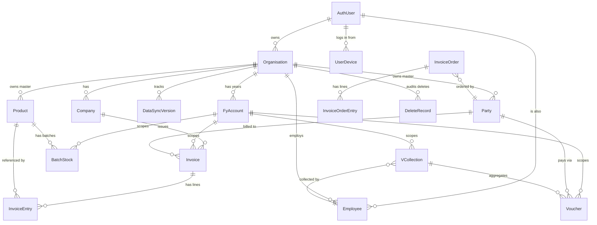
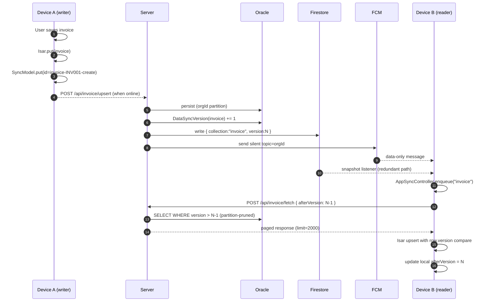
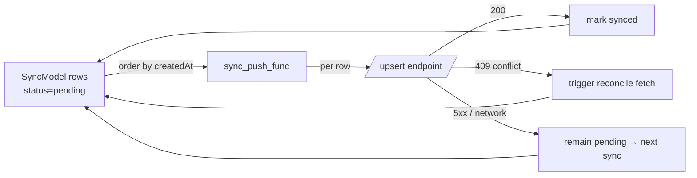
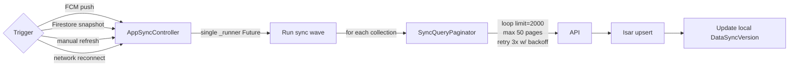
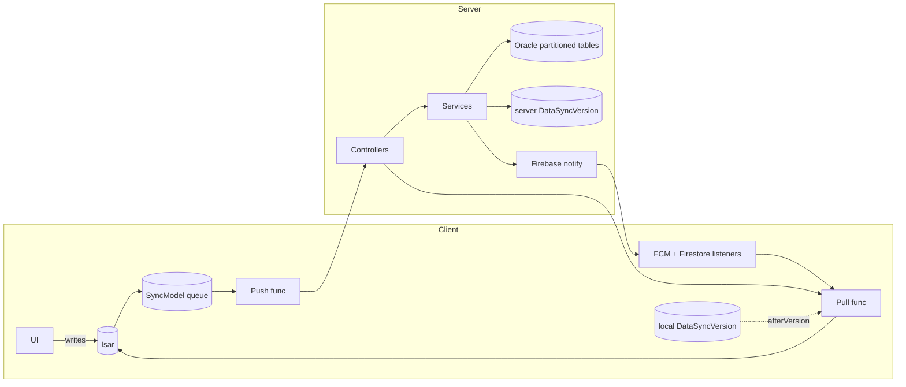

# DATABASE_AND_SYNC.md — Vanigam

> Authoritative reference for the persistent data model (Oracle server + Isar client) and the bidirectional synchronisation lifecycle.

---

## 1. Entity Catalogue (Server / Oracle)

### 1.1 Profile domain

| Entity         | Table          | Key fields                                                                                                                                                                                                                                                                                                                                                                                                                            | Notes                    |
| -------------- | -------------- | ------------------------------------------------------------------------------------------------------------------------------------------------------------------------------------------------------------------------------------------------------------------------------------------------------------------------------------------------------------------------------------------------------------------------------------- | ------------------------ |
| `AuthUser`     | `auth_user`    | `uId` (PK = Firebase UID), `name`, `email` (unique), `authBy`, `maxDevice`, `maxOrganisation`, `currency`, `image`, `dob`, `disabled`, `emailVerified`, `status`                                                                                                                                                                                                                                                                      | Root of ownership        |
| `Organisation` | `organisation` | `id` (PK, e.g. `O001`), `user_id` (FK), `name` (unique per user), `financialMonth`, `currency`, `syncable`, feature flags (`estimateInvoiceFeature`, `invoiceCollectionFeature`, `productOfferfeature`, `exportInvoiceFeature`, `inventoryFeature`, `orderFeature`, `smartOrderSuggessionFeature`, `smartStockSuggessionFeature`), `maxCompany`, `maxEmployee`, `metaData` (CLOB JSON → `OrganisationMeta`), `subscription` (Instant) | Tenant root              |
| `Company`      | `company`      | `id` PK, `organisation_id` FK, `name`, `proprietorName`, `gstNo`, `stateCode`, `pincode`, `mobileNo`, `address`, `logo` (CLOB base64), `metaData` (CLOB), `status`, `invoiceNoPattern`, `exportInvNoFormat`                                                                                                                                                                                                                           | Sub-tenant for billing   |
| `Employee`     | `employee`     | `id` PK, `organisation_id` FK, `user_id` FK, `name`, `emailId` (unique per org), `role`, `rName`, `mobileNo`, `address`, `area`, `pincode`, `partiesTag` (List<String> CLOB), `productsTag` (List<String> CLOB), `partyAccess`, `productAccess`, `collectionAccess`, `invoiceAccess`, `orderAccess`, `employeeAccess` (all `ActionAccess`)                                                                                            | RBAC carrier             |
| `FyAccount`    | `fy_account`   | `id` PK (identity), `organisation_id` FK, `name` (unique per org), `period`                                                                                                                                                                                                                                                                                                                                                           | Financial year scope     |
| `UserDevice`   | `user_device`  | `id` PK (identity), `user_id` FK, `deviceId`, `deviceName`, `fcmToken`, `lastLogin` (CreationTimestamp)                                                                                                                                                                                                                                                                                                                               | One row per device login |

### 1.2 Master domain

| Entity    | Table     | Key fields                                                                                                                                                                                                                                                                                    | Notes            |
| --------- | --------- | --------------------------------------------------------------------------------------------------------------------------------------------------------------------------------------------------------------------------------------------------------------------------------------------- | ---------------- |
| `Party`   | `party`   | `id` PK, `organisation_id` FK (`@DbForeignKey`), `businessName`, `name`, `mobileNo`, `email`, `gst`, `address`, `location`, `pincode`, `stateCode`, `area`, `tags`, `types`, `limit` (credit), `maxDueInDays`, `image`, `partyGroupIds` (List<String> CLOB), `status`, `updatedAt`, `version` | Customer master  |
| `Product` | `product` | `id` PK, `name`, `title`, `description`, `printLabel`, `barcode`, `brand`, `category`, `mrp`, `price`, `gstRate`, `unit`, `minStockAlert`, `sku`, `hsnCode`, `image`, `tags`, `inventory`, `companyConfigs`, `unitConversions` (List<String> CLOB)                                            | Inventory master |

### 1.3 Transactional domain

| Entity              | Table                         | Key fields                                                                                                                                                                                                                                                                                                                                                                                                                                                                          | Notes                   |
| ------------------- | ----------------------------- | ----------------------------------------------------------------------------------------------------------------------------------------------------------------------------------------------------------------------------------------------------------------------------------------------------------------------------------------------------------------------------------------------------------------------------------------------------------------------------------- | ----------------------- |
| `Invoice`           | `invoice` ⚑ partitioned       | `id`, `invoiceNo`, `invoiceDate`, `partyName` snapshot, `partyGst`, `sellerGst`, `buyerStateCode`, `sellerStateCode`, `invoiceType` (`EInvoiceType`), `discount`, `gst`, `total`, `point`, `cashDiscount`, `orginalInvoiceNo`, `invoiceStatus` (`InvoiceStatus`), `paymentMode`, `orderId`, `remark`, `deliveredBy`, `deliveredOn`, `status` (`ItemStatus`), `updatedAt`, `version`, `partyId`, `companyId`, `orgId` (@PartitionKey), `fyAccountId` (@PartitionKey), `collectionId` | GST-bearing transaction |
| `InvoiceEntry`      | `invoice_entry` ⚑ partitioned | `id`, `idx`, `invoiceType`, `productName` snapshot, `hsnCode`, `batchNo`, `expiry`, `mfg`, `quantity`, `unit`, `freeQty`, `price`, `discount`, `gstRate`, `cessRate`, `mrp`, `purchaseRate`, `purchaseDiscount`, `invoiceNo`, `invoiceDate`, `meta`, `updatedAt`, `version`, `companyId`, `productId`, `invoiceId`, `orgId`, `fyAccountId`                                                                                                                                          | Line item               |
| `BatchStock`        | `batch_stock` ⚑ partitioned   | `id`, `productId`, `batchNo`, `stock`, `exported`, `mrp`, `cost`, `discount`, `expiry`, `updatedAt`, `version`, `companyId`, `orgId` (@PartitionKey), `fyAccountId` (@PartitionKey); `UNIQUE(org_id, company_id, product_id, batch_no, fy_account_id)`                                                                                                                                                                                                                              | Per-batch on-hand       |
| `VCollection`       | `collection` ⚑ partitioned    | `id`, `collectionNo` (`C001`-style), `name`, `collectionDate`, `userId`, `collectedBy`, `deliveredBy`, `collectionStatus` (`CollectionStatus`), `areas` (List<String>), `generatedReturnOrderIds` (List<String>), `cashInvoices` (List CLOB), `quotation`, `status`, `updatedAt`, `version`, `metaData`, `orgId`, `fyAccountId`                                                                                                                                                     | Route session           |
| `Voucher`           | `voucher` ⚑ partitioned       | `id`, `partyId`, `voucherDate`, `amount`, `source`, `invoiceId`, `details`, `attachments` (List<String>), `chqDate`, `chqNumber`, `chequeStatus`, `transType` (`TransType`), `paymentType` (`PaymentType`), `updatedAt`, `version`, `metaData`, `orgId`, `fyAccountId`, `collectionId`, `userId`                                                                                                                                                                                    | Single payment record   |
| `InvoiceOrder`      | `invoice_order`               | `id`, `orderNo`, `batchId`, `sourceInvoiceId`, `orderDate`, `invoiceType`, `orderStatus` (`OrderStatus`), `partyName` snapshot, `outlet`, `remark`, `userId`, `updatedAt`, `version`, `orgId`, `partyId`, `companyId`                                                                                                                                                                                                                                                               | Order header            |
| `InvoiceOrderEntry` | `order_entry`                 | `id`, `idx`, `orderId`, `productId`, `productName` snapshot, `quantity`, `unit`, `price`, `discount`, `gstRate`                                                                                                                                                                                                                                                                                                                                                                     | Order line              |

### 1.4 Helper / audit domain

| Entity            | Table               | Key fields                                                                                                                                                      | Notes                       |
| ----------------- | ------------------- | --------------------------------------------------------------------------------------------------------------------------------------------------------------- | --------------------------- |
| `DeleteRecord`    | `delete_record`     | `id`, `entityId`, `entityJson` (CLOB), `userName`, `note`, `tableName`, `updatedAt`, `version`, `fyAccountId`, `orgId`; `UNIQUE(table_name, entity_id, org_id)` | Soft-delete audit           |
| `DataSyncVersion` | `data_sync_version` | `id`, `organisation_id` FK, `collection` (`ECollections`), `version`; `UNIQUE(org_id, collection)`                                                              | Sync cursor source of truth |

---

## 2. Entity Relationships



Key implementation details:

- `@DbForeignKey(target=…, nullable=…)` is a custom annotation validated by `ForeignKeyRunner` at boot.
- `@PartitionKey` fields (`orgId`, `fyAccountId`) appear on transactional entities; they are also the SQL partition columns.
- `@OneToMany` is **eager** on `Invoice → InvoiceEntry` (because invoices are nearly always shown with lines) and **lazy** on `VCollection → Voucher`.

---

## 3. Oracle Partitioning

### 3.1 Strategy

Two flavours of `LIST ... AUTOMATIC` partitioning:

| Granularity                                    | Tables                                                                                        |
| ---------------------------------------------- | --------------------------------------------------------------------------------------------- |
| Single key — `organisation_id`                 | `company`, `data_sync_version`, `delete_entity`, `employee`, `party`, `product`, `fy_account` |
| Composite — `(organisation_id, fy_account_id)` | `invoice`, `invoice_entry`, `batch_stock`, `collection`, `voucher`                            |

```sql
ALTER TABLE INVOICE
  MODIFY PARTITION BY LIST (organisation_id, fy_account_id) AUTOMATIC
  (PARTITION p_invoice_o001_1 VALUES (('O001','1')));
```

`AUTOMATIC` partitioning means Oracle adds a new partition whenever a new `(orgId, fyId)` combination first appears — no manual DBA work when onboarding a tenant or rolling into a new financial year. The seeding statements live in [v2\_\_partition_script.sql](../../vanigam_server/src/main/resources/db/v2__partition_script.sql) and are also enforced at startup by [`PartitionInitializer`](../../vanigam_server/src/main/java/in/subbu/vanigam/runner/PartitionInitializer.java).

### 3.2 Benefits

- **Query pruning** — every query carries `orgId` (set from `RequestContext`) so the optimizer hits exactly one partition.
- **Isolation** — buggy queries cannot cross-tenant.
- **Maintenance** — partitions can be exported/archived independently (e.g. closed FYs).

---

## 4. Client (Isar) Data Model

Local collections mirror server entities (12+ collections) with the addition of operational tables:

| Isar collection                      | Mirrors                              | Extra columns                     |
| ------------------------------------ | ------------------------------------ | --------------------------------- |
| `InvoiceModel` / `InvoiceEntryModel` | `Invoice` / `InvoiceEntry`           | Local-only flags (e.g. `isDraft`) |
| `VoucherModel`                       | `Voucher`                            | —                                 |
| `CollectionModel`                    | `VCollection`                        | Cached aggregates                 |
| `OrderModel` / `OrderEntryModel`     | `InvoiceOrder` / `InvoiceOrderEntry` | —                                 |
| `ProductModel`                       | `Product`                            | Inventory pre-computations        |
| `BatchStockModel`                    | `BatchStock`                         | —                                 |
| `PartyModel`                         | `Party`                              | Outstanding cache                 |
| `EmployeeModel`                      | `Employee`                           | —                                 |
| `FYAccountModel`                     | `FyAccount`                          | —                                 |
| **`SyncModel`**                      | _no server equivalent_               | Local pending-operation queue     |
| **`DeleteRecordModel`**              | `DeleteRecord`                       | Mirror for prune logic            |

Database name: `${AppType}_v1` (e.g. `vanigam_v1`, `vanigam_dev_v1`, `vanigam_stag_v1`).

---

## 5. Synchronisation Lifecycle

### 5.1 Concepts

- **`DataSyncVersion(orgId, collection)`** — monotonically increasing counter; bumped server-side on any mutation in that collection.
- **`SyncModel`** — local queue row. Composite id `entityType-entityId-operation` ensures **idempotency** — re-enqueueing the same change _replaces_ the previous one.
- **`afterVersion` cursor** — client stores the last successfully ingested `DataSyncVersion.version` per collection; the next pull asks `POST /api/.../fetch { afterVersion }`.
- **Topic = `orgId`** — every device subscribed to its organisation's FCM topic receives a _silent_ push containing `{ collection, version, orgId }`.

### 5.2 Full lifecycle diagram



### 5.3 Push (local → server) detail



Rules:

- Push is **fire-and-forget after Isar commit** — UI never waits.
- The queue is drained in `createdAt` order so dependencies (party before invoice) are preserved.
- Idempotent composite id means crashes mid-push cannot create duplicates.

### 5.4 Pull (server → local) detail



Defensive caps:

- `limit = 2000` rows per page.
- `maxPages = 50` ⇒ a single sync wave caps at 100 000 rows; beyond that it breaks defensively to avoid runaway loops (a follow-up wave continues).
- `retries = 3`, base delay 500 ms exponential.
- `seenIds` Set dedupes responses across pages (defends against server returning overlapping windows during high churn).

### 5.5 Conflict resolution

| Scenario                            | Detection                                                                                       | Resolution                                                                                 |
| ----------------------------------- | ----------------------------------------------------------------------------------------------- | ------------------------------------------------------------------------------------------ |
| Concurrent edit, same row           | Hibernate `@Version` mismatch → `409 CONFLICT`                                                  | Client refetches authoritative row; if UI fields differ, dialog → user picks; else silent. |
| Delete-vs-update race               | `EntityNotFoundException` → `404` on update; `DeleteRecord` row tells client to drop local copy | Client removes Isar row, notifies UI.                                                      |
| Tenant header tampering             | `OrgMismatchException` → `424`                                                                  | Client forces org reselect.                                                                |
| Two devices closing same collection | Server enforces "only one IN_PROGRESS collection per user" → `IllegalStateException` → `409`    | UI prompts user to choose.                                                                 |

### 5.6 Caching / invalidation interplay

- **Server Caffeine** caches `AuthUser` (15 min). Mutations should `@CacheEvict("users", key="#uId")`. Mass invalidation occurs on org deletion.
- **Client Isar** is itself the cache — invalidation is via `version` overwrite or `DeleteRecord` propagation.
- **Cross-node drift** is bounded to TTL (15 min) until a Redis L2 is introduced.

### 5.7 Transactional consistency

- Server: `@Transactional` boundaries wrap entity write + `DataSyncVersion` increment + audit write so the broadcast is meaningful.
- Recommended pattern: emit Firestore + FCM via `@TransactionalEventListener(AFTER_COMMIT)` to avoid notifying about a transaction that later rolls back.

---

## 6. Sync Collection Enum (`ECollections`)

```
companyLogo, profile, employee, party, product, empProof, customerProof,
image, invoice, deleteRecord, ledger, stock, voucher, collection, order
```

Each value becomes both:

- a key in `DataSyncVersion(orgId, collection)`, and
- a fetch endpoint coordinate on the client (`sync_fetch_func`).

---

## 7. Failure Modes & Recovery

| Failure                                | Symptom               | Recovery                                                                                       |
| -------------------------------------- | --------------------- | ---------------------------------------------------------------------------------------------- |
| Server returns stale page              | Duplicate rows        | `seenIds` dedup skips them                                                                     |
| Push 409 on stale baseVersion          | Local row out of date | reconcile fetch + retry                                                                        |
| Network drops mid page                 | Partial write         | retry from same `offset` (server is idempotent)                                                |
| Stock drift after invoice cancellation | Stock value mismatch  | Admin calls `POST /api/data_entity/recompute_stock`                                            |
| Token expires mid sync                 | 401 cascade           | Force re-auth, queue persists                                                                  |
| Oracle partition missing               | Insert blocked        | `PartitionInitializer` retries on next boot; manual SQL fallback in `v2__partition_script.sql` |

---

## 8. Reporting & Read Path

Reports do **not** hit the API — they query Isar locally for snappy UX. The trade-off is acceptable because:

1. Sync versioning keeps Isar within seconds of the server.
2. Aggregations are bounded by org / FY (partition-equivalent on client too).
3. Charts (`fl_chart`) and PDFs render off the same cached collections.

Anticipated read endpoints (future) for very large datasets could leverage the same `SyncQueryPaginator` + a dedicated `/report/*` endpoint backed by materialised views in Oracle.

---

## 9. Schema Migration Strategy

- The single migration file present today is [v2\_\_partition_script.sql](../../vanigam_server/src/main/resources/db/v2__partition_script.sql).
- Hibernate `ddl-auto` is **assumed `validate` in prod, `update` in dev** based on the conservative property layout.
- Going forward, **Flyway/Liquibase** would manage incremental DDL; the `v2__` filename hints at Flyway versioning convention.

---

## 10. Backup & Restore

- **Per-org Drive backup** triggered by `BackgroundService` according to `OrganisationMeta.backupIntervalMinutes`.
- Backup contents: serialized Isar collections + meta version.
- Restore path: settings → restore from Drive → wipes Isar → ingests + re-runs sync to fill any gaps from server.

---

## 11. Pictorial Recap


