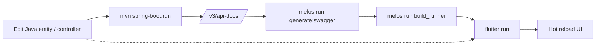

# DEVELOPER_GUIDE.md — Vanigam

> Everything a new engineer needs to clone, run, build, debug, test and deploy Vanigam end-to-end.

---

## 1. Repository Layout

```
vanigam-monorepo/
├── vanigam/              # Flutter client (Android / iOS / macOS / Windows)
│   ├── lib/              # Production code
│   ├── cli/              # Custom build tooling (Swagger generator)
│   ├── gen/              # dart_define.json + generation outputs
│   ├── locales/          # Runtime translations
│   ├── melos.yaml        # Script orchestration
│   └── pubspec.yaml
└── vanigam_server/       # Spring Boot 3.5 / Java 21 backend
    ├── src/main/java/in/subbu/vanigam
    ├── src/main/resources
    ├── scripts/          # deploy / start / log / monitoring shell scripts
    └── pom.xml
```

`vanigam/` is technically a Melos-managed monorepo though it currently exposes a single Flutter package — Melos is used for **scripts and CI orchestration**.

---

## 2. Prerequisites

| Tool                                     | Version       | Notes                                                                    |
| ---------------------------------------- | ------------- | ------------------------------------------------------------------------ |
| Flutter SDK                              | `^3.41.1`     | `flutter doctor` should pass for every target platform you plan to ship. |
| Dart SDK                                 | `^3.11.5`     | Bundled with Flutter.                                                    |
| Melos                                    | latest        | `dart pub global activate melos`                                         |
| Java                                     | **21**        | OpenJDK or Oracle JDK 21.                                                |
| Maven                                    | 3.8+          | Or use the included `mvnw`.                                              |
| Oracle Instant Client + Wallet           | for ADW       | Path goes into `application-dev.properties`.                             |
| OCI CLI                                  | latest        | Required only for production secret retrieval.                           |
| Firebase project                         | —             | Auth + Cloud Messaging + Firestore.                                      |
| `firebase-config.json` (service account) | —             | Drop into `vanigam_server/src/main/resources/static/config/`.            |
| Android SDK / Xcode / Windows MSVC       | as per target | For native builds.                                                       |

---

## 3. First-Time Setup

### 3.1 Clone & install

```bash
git clone <repo>
cd vanigam
dart pub global activate melos
melos bootstrap            # currently a no-op (single package) but kept for future packages
flutter pub get
```

### 3.2 Backend prep

```bash
cd vanigam_server
# place wallet for Oracle ADW (only needed in dev)
export TNS_ADMIN=/path/to/wallet
# copy the Firebase service account JSON
cp ~/Downloads/firebase-config.json src/main/resources/static/config/firebase-config.json
mvn clean install -DskipTests
```

### 3.3 Run the backend

```bash
mvn spring-boot:run -Dspring-boot.run.profiles=dev
# Banner prints:
#   Application URL  http://localhost:8083
#   Swagger UI       http://localhost:8083/swagger-ui.html
#   OpenAPI JSON     http://localhost:8083/api-docs
#   Actuator         http://localhost:8083/actuator/health
```

The Swagger UI is **disabled in prod** (`springdoc.swagger-ui.enabled=false` in [application-prod.properties](../../vanigam_server/src/main/resources/application-prod.properties)).

### 3.4 Generate the Dart API client

```bash
cd vanigam
# point the CLI at a running backend or a saved openapi.json
melos run generate:swagger
```

What this runs (see [cli/generate_swagger.dart](../cli/generate_swagger.dart)):

1. Wipes `lib/generated/api/`.
2. Invokes `dart run swagger_parser` against the OpenAPI source.
3. Patches `File` → `MultipartFile` for Dio multipart endpoints.
4. Runs `flutter pub run build_runner build --delete-conflicting-outputs` to produce `.mapper.dart` files.
5. `dart format .` for tidiness.

### 3.5 Generate Isar / auto_route / flutter_gen

```bash
melos run build_runner
# equivalent to: flutter pub run build_runner build --delete-conflicting-outputs
```

This must succeed before the app compiles — Isar collection files, the `auto_route` generated router, and flutter_gen asset bindings are required.

### 3.6 Run the app

```bash
flutter run --dart-define-from-file=gen/dart_define.json
```

For desktop targets:

```bash
flutter run -d windows --dart-define-from-file=gen/dart_define.json
flutter run -d macos   --dart-define-from-file=gen/dart_define.json
```

---

## 4. Environments / Flavours

The app reads its environment from `lib/config/environment.dart` and the build-time `dart_define`:

| Environment | Isar DB           | API base URL    | Swagger UI |
| ----------- | ----------------- | --------------- | ---------- |
| Dev         | `vanigam_dev_v1`  | local server    | enabled    |
| Staging     | `vanigam_stag_v1` | staging host    | enabled    |
| Production  | `vanigam_v1`      | production host | disabled   |

Switch by editing `gen/dart_define.json` or by passing additional `--dart-define KEY=value`.

---

## 5. Code Generation Cheatsheet

| Goal                                        | Command                      |
| ------------------------------------------- | ---------------------------- |
| Re-pull API from server                     | `melos run generate:swagger` |
| Regenerate Isar / routes / mappers / assets | `melos run build_runner`     |
| Clean Flutter outputs                       | `melos run clean:flutter`    |
| Re-install CocoaPods (iOS)                  | `melos run clean:ios:pods`   |
| Re-install CocoaPods (macOS)                | `melos run clean:macos:pods` |
| Bundle APK                                  | `melos run build:apk`        |
| Bundle AAB                                  | `melos run build:aab`        |
| Windows release                             | `melos run build:windows`    |

---

## 6. Project Conventions

- **Imports** — Always import `SyncQueryPaginator` from `package:vanigam/core/repository/utils/sync_query_paginator.dart`. `core.export.dart` does not re-export it (see user memory note).
- **Time zones** — Call `initializeTimeZones()` from `package:timezone/data/latest.dart` before using `TZDateTime` / `getLocation` (e.g., before any audit-key generation tied to "company day").
- **Sync helpers** — When adding a new domain repository, mix in `AppRepo` and use `SyncQueryPaginator` for `fetch` endpoints to inherit the retry / dedup logic.
- **Server entities** — When introducing a new entity, decorate `@Version`, `updatedAt`, and partition keys (`orgId`, `fyAccountId`) consistently with existing transactional entities.
- **New endpoints** — Add Swagger `@Schema`/`@Tag` annotations so the generated Dart client picks them up cleanly.

---

## 7. Debugging

### 7.1 Flutter

- **Logging** — `logger` package emits structured output; the global error zone in `main.dart` forwards uncaught errors.
- **Isar Inspector** — run `flutter run` then open the printed Isar Inspector URL to browse local data.
- **Router** — `MyRouteObserver` logs every push/pop.
- **Network** — Dio interceptor can be flipped to verbose; check `lib/core/client/`.
- **Offline debugging** — toggle airplane mode; the `internet_connection_checker` reacts within ~1s; `OfflineDashboardRoute` displays.

### 7.2 Spring Boot

- **Actuator** — `/actuator/health`, `/actuator/metrics`, `/actuator/caches` (Caffeine stats).
- **Logback** — adjust levels in `application-dev.properties`; default app log path on server is `/home/opc/app/app.log`.
- **Database** — Oracle `v$session` plus partition-name predicates help debug pruning.
- **Exception envelope** — every error is JSON `{ status, code, message }` via `GlobalExceptionHandler`.

---

## 8. Testing

| Layer               | Recommended tooling                                                                  |
| ------------------- | ------------------------------------------------------------------------------------ |
| Flutter unit        | `flutter test` with mocked repositories (`mocktail` recommended).                    |
| Flutter widget      | `flutter test` with `pumpWidget` + golden tests.                                     |
| Flutter integration | `integration_test` package targeting a seeded Isar + mocked Dio.                     |
| Spring controllers  | `@SpringBootTest` with `MockMvc` + Testcontainers Oracle (or H2 with Oracle-compat). |
| Service layer       | JUnit 5 + Mockito.                                                                   |
| Sync engine         | Dart unit tests against fakes for `SpringApi` and an in-memory Isar instance.        |

> The repo does not yet ship comprehensive test suites — when adding tests, mirror the feature-folder structure (`test/feature/<feature>/...`).

---

## 9. Local Development Loop



Tip: keep the backend running and skip the Swagger regeneration if the change is internal (no DTO surface area).

---

## 10. Release Process

### 10.1 Backend

```bash
cd vanigam_server
mvn clean package -DskipTests        # → target/vanigam-0.0.1.jar
./scripts/deploy.sh                  # builds, scp to OCI host, restarts
```

Inside `scripts/start-application.sh` (executed remotely):

1. Pulls DB credentials from OCI Vault via `oci secrets secret-bundle get`.
2. Exports `DB_USERNAME`, `DB_PASSWORD`, `DB_URL`.
3. Gracefully kills the previous instance, falls back to `kill -9` after a timeout.
4. Starts: `java -Dspring.profiles.active=prod -jar vanigam-0.0.1.jar`.
5. Tails to `/home/opc/app/app.log`.

### 10.2 Frontend

| Target      | Output                                                                                  |
| ----------- | --------------------------------------------------------------------------------------- |
| Android APK | `build/app/outputs/flutter-apk/app-release.apk`                                         |
| Android AAB | `build/app/outputs/bundle/release/app-release.aab` (Play Store)                         |
| Windows     | `build/windows/x64/runner/Release/` (zipped + uploaded to Google Drive `versions.json`) |
| macOS / iOS | Standard `xcodebuild` flow off the Flutter build                                        |

**Auto-update flow:** `UpdateManager` consults the Drive-hosted `versions.json` weekly; Windows downloads + launches `WindowsUpdateInstallService`. The current version surface is `1.0.0+30` from [pubspec.yaml](../pubspec.yaml).

### 10.3 Versioning convention

- Backend: `pom.xml` `0.0.1`, Spring banner stamped via `application.properties`.
- Frontend: `pubspec.yaml` `1.0.0+<buildNumber>`. Increment build number per release; bump semantic version on UX-breaking changes.

---

## 11. Operational Runbook

| Task                       | Where                                                                          |
| -------------------------- | ------------------------------------------------------------------------------ |
| View logs                  | `vanigam_server/scripts/view-logs.sh` (or open Tailon at `http://server:8099`) |
| Open Netdata               | `vanigam_server/scripts/start-netdata-tunnel.sh` then `http://localhost:19999` |
| Restart service            | re-run `start-application.sh` remotely                                         |
| Recompute stock            | `POST /api/data_entity/recompute_stock` (admin)                                |
| Delete org                 | `DELETE /api/data_entity/organisation` (irreversible)                          |
| Rotate DB password         | Update OCI Vault secret; next restart picks it up                              |
| Add new partition manually | Use the `ALTER TABLE ... PARTITION` patterns in `v2__partition_script.sql`     |

---

## 12. Adding a new feature (end-to-end)

1. **Server** — define entity (`@Entity`, `@Version`, `@DbForeignKey`), repository, service, controller. Add `@Schema` annotations.
2. **Migrate** — if new table, add partitioning DDL alongside `v2__partition_script.sql` (or new Flyway migration).
3. **Regenerate** — `melos run generate:swagger` to refresh Dart models.
4. **Sync glue** — add the new collection to `ECollections` (server) and to client sync fetch list. Add a `DataSyncVersion` row.
5. **Repository** — create `XyzRepository extends ChangeNotifier with AppRepo` in `lib/core/repository/`.
6. **Isar model** — create the `XyzModel` Isar collection. Regenerate with `build_runner`.
7. **Routes** — add `@AutoRoute(...)` entries in `app_router.dart`.
8. **Screens** — create form / listing / details pages.
9. **DI** — register the new repository in `get_it_setup.dart` and provide it in `AppInit`.
10. **Notifications** — wire status/topic broadcasts in the service layer.
11. **Tests** — unit-test the service, widget-test the form, integration-test the offline → online round-trip.

---

## 13. Troubleshooting

| Symptom                                 | Likely cause                                        | Fix                                                                       |
| --------------------------------------- | --------------------------------------------------- | ------------------------------------------------------------------------- |
| `Type SyncQueryPaginator not found`     | Wrong import path                                   | Import from `lib/core/repository/utils/sync_query_paginator.dart`         |
| Timezone audit keys off by a day        | `initializeTimeZones()` not called                  | Add it during app boot before any `TZDateTime` use                        |
| `424 FAILED_DEPENDENCY` ORG_ID_MISMATCH | Stale `X-Org-Id` header after org switch            | Refresh from `AuthRepository.currentOrg`                                  |
| `409 CONFLICT` after pull               | Optimistic lock — local was stale                   | Reconcile fetch already triggered; retry submit                           |
| Oracle `ORA-14400` (partition missing)  | New `(orgId, fyId)` combination not yet partitioned | Re-run `PartitionInitializer` or apply `v2__partition_script.sql` snippet |
| FCM not delivering                      | Token refreshed but topic not re-subscribed         | Ensure `AppMessagingService.onTokenRefresh` re-subscribes                 |
| Isar `IsarError: Schema mismatch`       | Forgot to run `build_runner` after model change     | `melos run build_runner`                                                  |
| Generated client missing endpoint       | OpenAPI not regenerated                             | `melos run generate:swagger`                                              |

---

## 14. Coding Style

- **Dart:** follow `flutter_lints`; format with `dart format`.
- **Java:** Lombok where useful; prefer constructor injection; avoid field injection; keep services `@Transactional`.
- **SQL:** uppercase keywords; partition predicate first.
- **Commit messages:** imperative (`Add invoice approve action`, not `Added`).

---

## 15. References

- [README.md](README.md) — product overview
- [ARCHITECTURE.md](ARCHITECTURE.md) — engineering deep dive
- [FEATURE_DOCUMENTATION.md](FEATURE_DOCUMENTATION.md) — every screen / route / endpoint
- [DATABASE_AND_SYNC.md](DATABASE_AND_SYNC.md) — entities, partitioning, sync lifecycle
- [PORTFOLIO_SUMMARY.md](PORTFOLIO_SUMMARY.md) — recruiter-facing summary
