# Vanigam — Field Sales, Collection & GST Billing Platform

> **Vanigam** (வணிகம் — Tamil for _"commerce"_) is a multi‑tenant, offline‑first, cross‑platform operational workflow platform that digitises the daily field workflow of wholesalers, distributors, retailers and small lenders — from order capture and GST invoicing to route‑based payment collection, batch‑level inventory and multi‑company accounting.
>
> It is **not a CRUD app**. It is an enterprise‑grade operational platform with route partitioning at the database level, version‑based bidirectional synchronisation, FCM‑driven cache invalidation and per‑resource RBAC.

[](https://flutter.dev)
[](https://dart.dev)
[](https://spring.io/projects/spring-boot)
[](https://openjdk.org/)
[](https://www.oracle.com/autonomous-database/)
[](https://firebase.google.com/)

---

## Table of Contents

1. [Product Overview](#1-product-overview)
2. [System Architecture](#2-system-architecture)
3. [Tech Stack](#3-tech-stack)
4. [Core Business Workflows](#4-core-business-workflows)
5. [Offline‑First Implementation](#5-offlinefirst-implementation)
6. [Synchronisation Lifecycle](#6-synchronisation-lifecycle)
7. [Deployment Architecture](#7-deployment-architecture)
8. [API Generation Pipeline](#8-api-generation-pipeline)
9. [Project Layout](#9-project-layout)
10. [Getting Started](#10-getting-started)
11. [Engineering Decisions](#11-engineering-decisions)
12. [Production Readiness](#12-production-readiness)
13. [Performance & Scalability](#13-performance--scalability)
14. [Security](#14-security)
15. [Future Roadmap](#15-future-roadmap)
16. [Resume‑Worthy Highlights](#16-resumeworthy-highlights)
17. [Companion Documents](#17-companion-documents)

---

## 1. Product Overview

Vanigam started as a **lending‑and‑collection ledger** for small lenders (see the original problem statement in [README.md](../README.md)) and evolved into a **field‑sales operating system** with these production capabilities:

| Capability                   | What it does                                                                                                                |
| ---------------------------- | --------------------------------------------------------------------------------------------------------------------------- |
| **GST Invoicing**            | Sales, Purchase, Return, Estimate, Export invoices with HSN, CESS, inter/intra‑state GST split, batch & expiry tracking     |
| **Route Collection**         | Field‑agent collection sessions (DRAFT → IN_PROGRESS → CLOSED) linking multiple invoices, cash, cheque & online vouchers    |
| **Order‑to‑Invoice**         | Standalone orders that convert into invoices with status lifecycle (PENDING → SUBMITTED → CONVERTED_TO_INVOICE)             |
| **Multi‑Company / Multi‑FY** | One user owns multiple organisations; each organisation has multiple companies & financial years (`FyAccount`)              |
| **Role‑Based Access**        | Per‑resource `ActionAccess` (NONE / VIEWER / EDITOR / APPROVER) across party, product, collection, invoice, order, employee |
| **Offline‑First**            | Full operations work disconnected; Isar local DB; pending operations replayed with version‑based optimistic concurrency     |
| **Real‑time Sync**           | Silent FCM topic per organisation; Firestore version doc broadcasts trigger paginated incremental pulls                     |
| **Reports & Insights**       | Sales, stock, party, GST and collection insights with charts (`fl_chart`) and PDF export                                    |
| **Backups**                  | Automatic & manual backup to Google Drive (configurable interval per organisation)                                          |
| **Multi‑Platform**           | Android, iOS, macOS, Windows (with desktop auto‑updater) — single Flutter codebase                                          |

### Inferred Personas

| Persona                  | Primary surfaces                                                                                                         |
| ------------------------ | ------------------------------------------------------------------------------------------------------------------------ |
| **Owner / Admin**        | Organisation + Company setup, employee invites, party/product masters, approve collections, reports, backups             |
| **Field Collector**      | Mobile UI, route‑based party list, create invoices, record cash/cheque vouchers, submit collection sessions for approval |
| **Sales Executive**      | Order capture, estimate creation, customer credit‑limit checks, stock lookup                                             |
| **Finance / Accountant** | Approve / reject / print invoices, reconcile cheques, fiscal‑year close, GST reports                                     |

---

## 2. System Architecture

### 2.1 High‑Level Topology

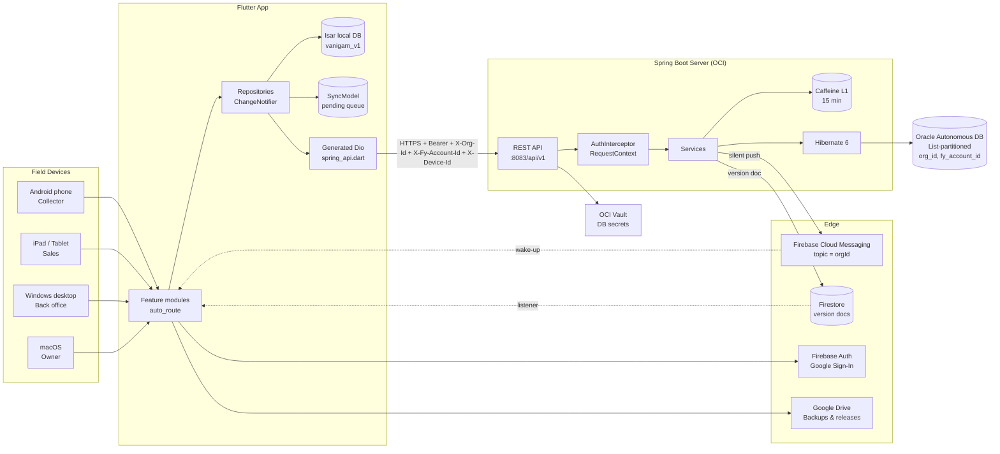

### 2.2 Clean Architecture inside the Flutter app

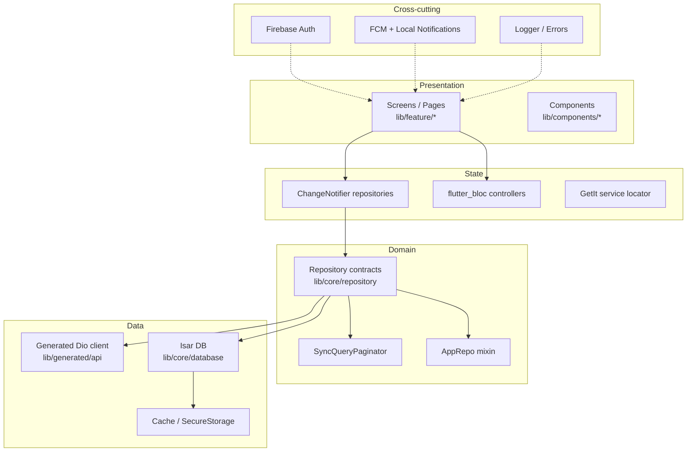

### 2.3 Spring Boot layered view

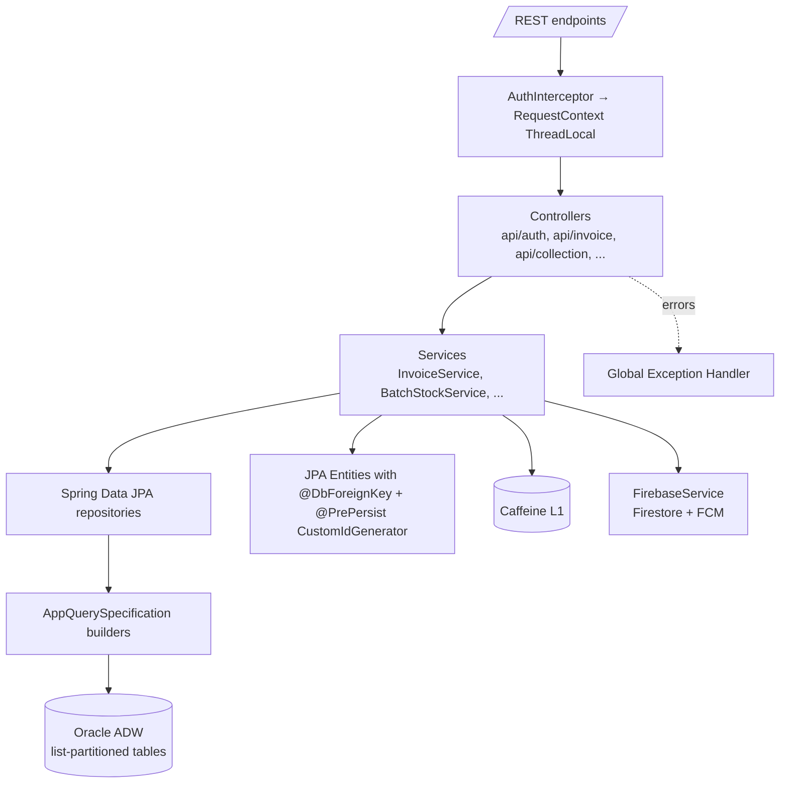

---

## 3. Tech Stack

### 3.1 Frontend (Flutter monorepo)

| Concern          | Choice                                                                                                                                        |
| ---------------- | --------------------------------------------------------------------------------------------------------------------------------------------- |
| Language / SDK   | Dart `^3.11.5`, Flutter `^3.41.1`                                                                                                             |
| Monorepo tooling | [Melos](melos.yaml) (scripts only; single Flutter pubspec)                                                                                    |
| Routing          | `auto_route` v11 — 50+ typed routes, deep‑linking, route observer                                                                             |
| State management | `provider` (ChangeNotifier repos) + `flutter_bloc` (feature controllers) + `get_it` (locator)                                                 |
| Local DB         | `isar_community` v3 (NoSQL, fast, multi‑platform)                                                                                             |
| HTTP client      | `dio` v5 with custom interceptors                                                                                                             |
| API client       | **Generated** from server's OpenAPI 3 spec via `swagger_parser` + custom patcher in [cli/generate_swagger.dart](../cli/generate_swagger.dart) |
| Serialisation    | `dart_mappable` (compile‑time JSON mappers)                                                                                                   |
| Auth             | `firebase_auth` + `google_sign_in_all_platforms`                                                                                              |
| Messaging        | `firebase_messaging` + `flutter_local_notifications` + background isolate handler                                                             |
| Theming          | `flex_color_scheme` v8, responsive size engine                                                                                                |
| Charts           | `fl_chart`                                                                                                                                    |
| PDF              | Custom PDF rendering for invoices, vouchers, reports                                                                                          |
| Build constants  | `dart_define_from_file` driven by [gen/dart_define.json](../gen/dart_define.json)                                                             |
| i18n             | ARB‑based + `locales/EN_US.json` runtime strings                                                                                              |

### 3.2 Backend

| Concern       | Choice                                                                                    |
| ------------- | ----------------------------------------------------------------------------------------- |
| Framework     | Spring Boot **3.5.8**                                                                     |
| Language      | Java **21**                                                                               |
| ORM           | Hibernate 6 (Spring Data JPA)                                                             |
| Database      | **Oracle Autonomous DB** — list‑partitioned by `(organisation_id, fy_account_id)`         |
| Cache         | Caffeine — 1 200 entries, 15‑min TTL                                                      |
| Auth          | Firebase Admin SDK 9.4.3 (verify ID tokens)                                               |
| Notifications | FCM silent push, topic = `orgId`                                                          |
| Sync trigger  | Firestore document write per collection version                                           |
| API docs      | Springdoc OpenAPI 2.8.6 → `/swagger-ui.html` (dev only)                                   |
| Secrets       | OCI Vault (DB user / password / URL fetched on startup)                                   |
| Build         | Maven 3.8+                                                                                |
| Monitoring    | Spring Actuator + Netdata + Tailon                                                        |
| Deployment    | OCI Compute, jar over SSH via [scripts/deploy.sh](../../vanigam_server/scripts/deploy.sh) |

---

## 4. Core Business Workflows

### 4.1 Field Collection Workflow

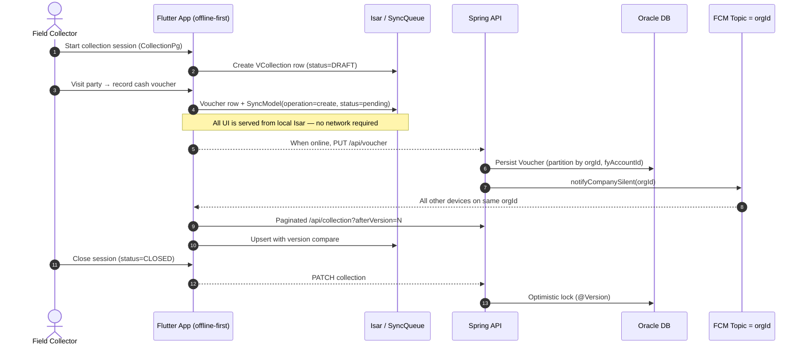

### 4.2 Invoice → Stock Lifecycle

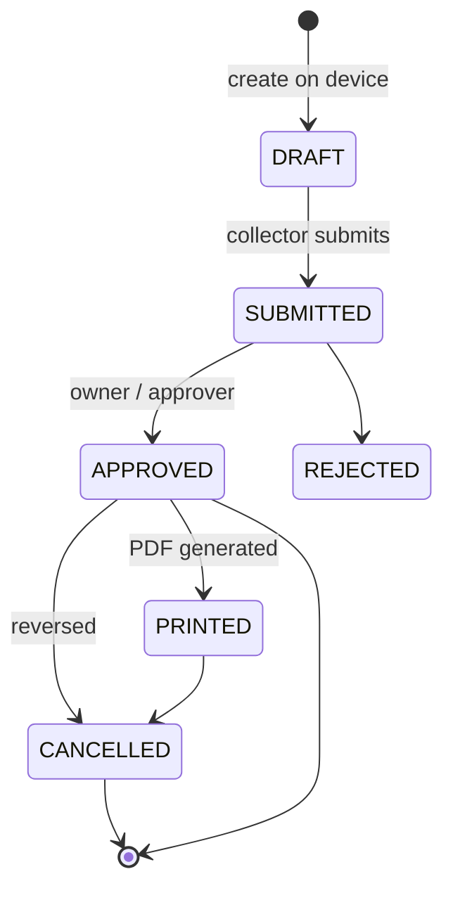

Every `INVOICE_ENTRY` row mutation rolls into a `BATCH_STOCK` row keyed by `(orgId, companyId, productId, batchNo, fyAccountId)`. The server exposes `POST /api/data_entity/recompute_stock` to rebuild stock if drift is detected.

### 4.3 Order → Invoice Conversion

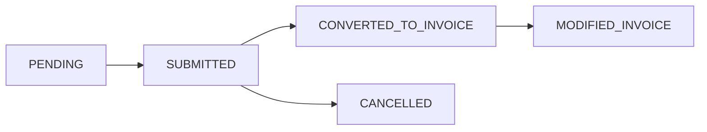

### 4.4 Authentication & Tenant Resolution

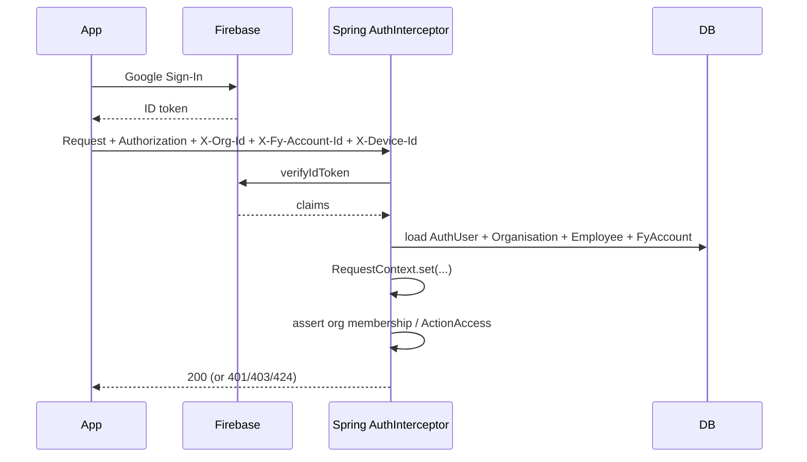

The headers `X-Org-Id` and `X-Fy-Account-Id` are mandatory tenant hints — mismatches between the JWT user and the requested org produce a **424 FAILED_DEPENDENCY** with code `ORG_ID_MISMATCH`.

---

## 5. Offline‑First Implementation

The app is built around the assumption that **the device is the source of truth between syncs**. UI never blocks on the network.

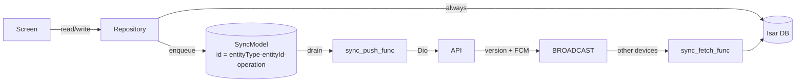

Key building blocks (all in [lib/core/repository/](../lib/core/repository/) and [lib/feature/sync/](../lib/feature/sync/)):

- **`SyncModel`** — Isar collection. Composite id `{entityType}-{entityId}-{operation}` makes the queue idempotent: re‑enqueueing the same change overwrites the previous one. Fields: `status`, `operation`, `entityType`, `payloadJson`, `baseVersion`, `orgId`, `deviceId`, `userId`, `createdAt`.
- **`SyncQueryPaginator`** ([sync_query_paginator.dart](../lib/core/repository/utils/sync_query_paginator.dart)) — Reusable paginator: limit=2000, retry × 3 with 500ms–1.5s exponential backoff, deduplicates by `seenIds`, max 50 pages safety stop.
- **`AppSyncController`** ([app_sync_controller.dart](../lib/feature/sync/app_sync_controller.dart)) — Single `_runner` Future guarantees only one sync in flight. New events follow a **last‑event‑wins** queue.
- **`DeletedRecordRepository`** — Local audit of soft deletes, mirrored server‑side in `DELETE_RECORD` so other devices can prune their Isar copies.
- **`OfflineDashboardRoute`** — Dedicated UI when `internet_connection_checker` reports no link.

See [DATABASE_AND_SYNC.md](DATABASE_AND_SYNC.md) for the full lifecycle and conflict resolution rules.

---

## 6. Synchronisation Lifecycle

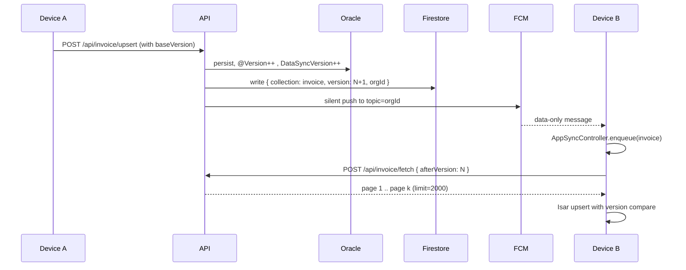

Each mutation increments two version counters:

1. **Row‑level `version`** (`@Version`) — Hibernate optimistic lock; surfaced as `409 CONFLICT` via `ObjectOptimisticLockingFailureException`.
2. **Collection‑level `DataSyncVersion`** per `(orgId, ECollections)` — used as the _afterVersion_ cursor by clients.

---

## 7. Deployment Architecture

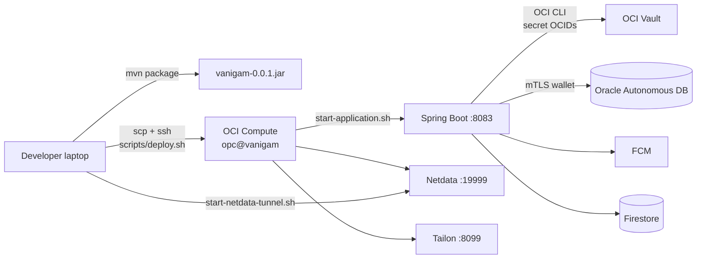

- **Production base path:** `/api/v1` on port `8083` (see [application-prod.properties](../../vanigam_server/src/main/resources/application-prod.properties)).
- **Secrets:** Three OCIDs (DB user / password / URL) are fetched from OCI Vault by [start-application.sh](../../vanigam_server/scripts/start-application.sh) and exported before the JVM boots.
- **Graceful shutdown:** 30‑second `spring.lifecycle.timeout-per-shutdown-phase`.
- **Mobile/desktop releases:** Versioned binaries published via Google Drive; the app self‑checks `versions.json` weekly and Windows installs through `WindowsUpdateInstallService`.

---

## 8. API Generation Pipeline

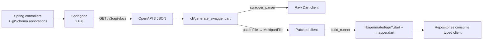

Run with `melos run generate:swagger` (see [Section 10](#10-getting-started)).

---

## 9. Project Layout

```
vanigam/                          # Flutter root
├── lib/
│   ├── main.dart                 # Zoned entry, error capture
│   ├── firebase_options.dart
│   ├── config/                   # router, environment, constants
│   ├── core/
│   │   ├── client/               # Dio + interceptors
│   │   ├── database/             # Isar models, enums
│   │   ├── di/                   # GetIt setup
│   │   ├── repository/           # 9 ChangeNotifier repos + SyncQueryPaginator
│   │   ├── service/              # FCM, cache, update manager, background
│   │   └── theme/                # responsive engine
│   ├── feature/                  # 20+ feature folders (see FEATURE_DOCUMENTATION.md)
│   ├── generated/                # auto_route.gr, swagger client, intl, assets
│   ├── components/               # shared widgets
│   └── l10n/
├── cli/generate_swagger.dart     # Custom OpenAPI → Dart pipeline
├── gen/dart_define.json          # Build-time constants
├── locales/EN_US.json
├── melos.yaml
├── pubspec.yaml
├── android/  ios/  macos/  windows/

vanigam_server/                   # Spring Boot root
├── pom.xml
├── src/main/java/in/subbu/vanigam/
│   ├── VanigamApplication.java
│   ├── annotation/               # @DbForeignKey, audit annotations
│   ├── config/                   # Security, Firebase, Cache, Swagger, Web
│   ├── context/                  # RequestContext (ThreadLocal) + SpringContext
│   ├── controller/               # 9 controllers grouped by domain
│   ├── entity/                   # 15 JPA entities (profile, master, invoice, collection, order, helper)
│   ├── middleware/               # AuthInterceptor, GlobalExceptionHandler
│   ├── repository/               # JPA repos + AppQuerySpecification + CustomIdGenerator
│   ├── runner/                   # PartitionInitializer, StartupLogger
│   ├── service/                  # 15 services
│   └── utils/
├── src/main/resources/
│   ├── application{,-dev,-prod}.properties
│   ├── db/v2__partition_script.sql
│   ├── static/config/firebase-config.json (gitignored)
│   └── static/html/{home,admin-access}.html
├── scripts/{deploy,start-application,remote-start,view-logs,start-netdata-tunnel}.sh
└── secrets/                      # encrypted vault material (gitignored in real deploys)
```

---

## 10. Getting Started

### 10.1 Prerequisites

- Flutter 3.41+, Dart 3.11+
- JDK 21, Maven 3.8+
- Oracle Wallet for Autonomous DB (dev) or OCI CLI with vault read permissions (prod)
- Firebase project with **Auth** and **Cloud Messaging** enabled
- `firebase-config.json` service account placed under `vanigam_server/src/main/resources/static/config/`

### 10.2 Backend

```bash
cd vanigam_server
# Dev (Oracle wallet path configured in application-dev.properties)
mvn spring-boot:run -Dspring-boot.run.profiles=dev
# → http://localhost:8083
# Swagger UI: http://localhost:8083/swagger-ui.html
```

### 10.3 Frontend

```bash
cd vanigam
flutter pub get
dart pub global activate melos
melos bootstrap

# 1. Generate API client from a running backend (or saved OpenAPI JSON)
melos run generate:swagger

# 2. Generate Isar collections, dart_mappable, auto_route
melos run build_runner

# 3. Run app
flutter run --dart-define-from-file=gen/dart_define.json
```

### 10.4 Build releases

```bash
melos run build:apk        # Android APK
melos run build:aab        # Play Store bundle
melos run build:windows    # Windows installer payload
```

Full instructions in [DEVELOPER_GUIDE.md](DEVELOPER_GUIDE.md).

---

## 11. Engineering Decisions

| Decision                                                  | Why                                                                                                                    |
| --------------------------------------------------------- | ---------------------------------------------------------------------------------------------------------------------- |
| **Isar over SQLite/Hive**                                 | Multi‑platform, fast, supports complex queries needed for offline reports; collections directly mirror server entities |
| **`auto_route` over `go_router`**                         | Better deep‑link builder, generated typed routes (50+), adaptive iOS/Android transitions                               |
| **ChangeNotifier + Bloc hybrid**                          | Repositories are global singletons (cross‑feature sync state) → ChangeNotifier; per‑screen interaction state → Bloc    |
| **Generated Dio client (not Retrofit/Chopper)**           | Single source of truth = server OpenAPI; the custom patcher fixes `File` → `MultipartFile` for Dio compatibility       |
| **List partitioning on Oracle by `(orgId, fyAccountId)`** | Multi‑tenant isolation + query pruning; sub‑partitions are created automatically when a new org/FY appears             |
| **`DataSyncVersion` per collection**                      | Cheap incremental sync without scanning rows; clients track a single `afterVersion` cursor                             |
| **Silent FCM rather than long‑polling**                   | Battery friendly; the actual data still flows over the REST sync endpoint to keep payloads small and resumable         |
| **Firebase Auth, not custom JWT**                         | Offloads device, MFA, password reset, Google Sign‑In to Firebase; server only verifies tokens                          |
| **ThreadLocal `RequestContext`**                          | Avoids passing user/org through every service signature; cleared by the interceptor on response                        |
| **Custom `@DbForeignKey` annotation**                     | Lets `ForeignKeyRunner` validate cross‑entity references at startup without polluting JPA mappings                     |
| **Caffeine 15‑min L1**                                    | Cuts repeat reads for AuthUser & Organisation lookups during a burst of mobile syncs                                   |
| **OCI Vault for prod secrets**                            | Removes DB credentials from disk; rotated independently of binary releases                                             |

---

## 12. Production Readiness

| Concern                | Status                                                                                      |
| ---------------------- | ------------------------------------------------------------------------------------------- |
| Graceful shutdown      | 30s drain on Spring Boot                                                                    |
| Optimistic concurrency | `@Version` on every mutable entity                                                          |
| Error envelope         | `GlobalExceptionHandler` → JSON `{ code, message, status }`                                 |
| Audit                  | `DELETE_RECORD` table + `DeleteRecordRepository`                                            |
| Health                 | `/actuator/health` + Netdata system metrics                                                 |
| Logs                   | Tailon UI + SSH `view-logs.sh`                                                              |
| Backups                | Per‑org auto Drive backup, manual export                                                    |
| Crash safety           | Zoned `runZonedGuarded`, FlutterError.onError forwarded to logger                           |
| Multi‑tenant safety    | Partition key + `OrgMismatchException` (424) on header tampering                            |
| Push reliability       | Topic re‑subscribe on FCM token refresh; offline‑detected via `internet_connection_checker` |

---

## 13. Performance & Scalability

- **Pagination ceiling** — `SyncQueryPaginator` limits a single sync wave to `2000 × 50 = 100 000` rows; beyond that the loop breaks defensively.
- **Oracle list partitioning** — Each tenant's data lives in its own physical partition; queries with `orgId` / `fyAccountId` predicates prune automatically.
- **Caffeine L1** — 1 200 entries / 15 min for hot reference data (`AuthUser`, `Organisation`).
- **Hibernate batch inserts** — `batch_size=100`, `order_inserts=true` for bulk imports.
- **Stateless API + ThreadLocal context** — horizontally scalable; the only stateful corner is Caffeine which is fine per‑node.
- **Silent FCM** — sync is _pull‑on‑push‑hint_ so server isn't on the hot path for clients that are simply idle.
- **Future scaling paths:** Redis L2 cache, read replicas for reports, columnar export to Oracle AI DB for forecasting, message queue (Kafka) between controller and Firestore broadcaster.

---

## 14. Security

- **Auth:** Firebase ID tokens, verified server‑side by Admin SDK on every request (no session cookies).
- **Tenant binding:** `AuthInterceptor` cross‑checks `Authorization` ↔ `X-Org-Id` ↔ Employee/Organisation rows; mismatches return **424**.
- **RBAC:** `ActionAccess` (NONE / VIEWER / EDITOR / APPROVER) per resource enforced inside services and surfaced in the Flutter `access_denied_pg.dart` page.
- **Data isolation:** Oracle list partitioning + every query filters on `orgId`.
- **Secrets:** OCI Vault; never in repo. The `secrets/` folder is for templates; encrypted values are referenced by OCID.
- **Encryption:** AES key in `app.encryption.key` for sensitive payload columns.
- **Transport:** Oracle Autonomous DB requires mTLS (wallet); REST API runs behind TLS termination on OCI.
- **CSRF:** Disabled (stateless API); CORS handled in `WebConfig`.
- **Mobile secure storage:** `flutter_secure_storage` for tokens & device id.
- **OWASP coverage:** Centralised exception handler masks stack traces (`A05: Security Misconfiguration`), optimistic locking prevents lost updates (`A04: Insecure Design`), role checks at service entry (`A01: Broken Access Control`).

---

## 15. Future Roadmap

- **Oracle AI Database integration** — Vector search over party/product corpora for "Smart Order Suggestion" feature flag already present on `Organisation`.
- **Redis L2** — Across‑node cache for `DataSyncVersion` look‑ups; reduce Caffeine cold start.
- **Real‑time insights** — WebSocket / SSE channel for live collection dashboards.
- **GST e‑Invoice** — Direct IRN generation through GSTN APIs.
- **CRDT‑based conflict resolution** — Replace last‑write‑wins for line‑item edits.
- **Pluggable analytics** — Export curated tables to a BI warehouse.
- **iOS push** — Apple developer account onboarding (current code path is ready).

---

## 16. Resume‑Worthy Highlights

- Designed and shipped an **offline‑first cross‑platform** field‑sales platform (Android / iOS / macOS / Windows) on a **single Flutter codebase** with 50+ typed routes and 20+ feature modules.
- Built an **idempotent sync engine** with version cursors, paginated incremental pulls (`SyncQueryPaginator`), exponential‑backoff retries, deduplication and last‑event‑wins coordination — running fully offline against Isar.
- Authored a **Springdoc → swagger_parser → patched Dio client** generation pipeline that keeps backend contract and 80+ frontend models in lock‑step on every CI run.
- Modelled an **Oracle multi‑tenant schema** with automatic list‑partitioning by `(organisation_id, fy_account_id)`, custom `@DbForeignKey` validation, and optimistic locking across 15 entities.
- Implemented **silent FCM cache invalidation** (topic = `orgId`) plus Firestore version documents to broadcast mutations to other devices without long‑polling.
- Delivered **per‑resource RBAC** with four levels (NONE/VIEWER/EDITOR/APPROVER) propagated from `Employee.partyAccess`/`invoiceAccess`/… into a ThreadLocal `RequestContext`.
- Productionised **OCI deployment** with vault‑driven secrets, Netdata + Tailon monitoring and SSH‑automated zero‑touch releases via `deploy.sh`.
- Engineered a **desktop auto‑update** path on Windows with Google‑Drive‑hosted manifests.

---

## 17. Companion Documents

| Document                                             | Scope                                                                 |
| ---------------------------------------------------- | --------------------------------------------------------------------- |
| [FEATURE_DOCUMENTATION.md](FEATURE_DOCUMENTATION.md) | Every screen, form, action, report and notification flow              |
| [ARCHITECTURE.md](ARCHITECTURE.md)                   | Clean architecture, DI, repos, sync engine, server layers, diagrams   |
| [DATABASE_AND_SYNC.md](DATABASE_AND_SYNC.md)         | Entity catalogue, ER diagram, partitioning, sync lifecycle, conflicts |
| [DEVELOPER_GUIDE.md](DEVELOPER_GUIDE.md)             | Setup, code‑gen, build, debug, test, release, deploy                  |
| [PORTFOLIO_SUMMARY.md](PORTFOLIO_SUMMARY.md)         | Recruiter‑facing summary, interview talking points                    |

---

> _Assumption notes:_ Some workflows (loan‑interest auto‑voucher generation, Google Drive backup cadence) are inferred from `Organisation` feature flags and the original lending README. The current code base is biased toward GST invoicing & route collection; lending‑specific auto‑voucher generation appears to be a planned extension surfaced via `Organisation.metaData`.
